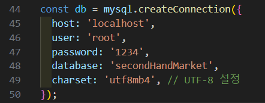

```markdown
# 중고장터 사이트

중고나라를 참고하여 **React**를 기반으로 제작된 중고 거래 웹사이트입니다.

## 주요 기능

- **회원가입 및 로그인**
- **마이페이지**: 사용자 정보 수정 기능
- **게시글 등록**: 제목, 내용, 카테고리, 가격 설정 가능
- **게시글 수정 및 삭제**
- **댓글 작성**: 공개 및 비공개 댓글 작성 가능
- **게시글 검색**: 카테고리별 게시글 검색 및 일반 검색(제목, 작성자) 지원

## 실행 환경

이 프로젝트는 **Node.js** 환경에서 실행되며, 다음이 필요합니다:

- **Node.js** (버전 14 이상 권장)
- **npm** (Node Package Manager)
- **mySQL workbench**
```

## 설치 및 실행 방법

1. mySQL에 데이터베이스를 생성합니다

   ```bash
   데이터베이스 명 : secondHandMarket

   create database secondHandMarket;
   ```

2. 실행에 필요한 테이블을 생성합니다.

   ```bash
   user 테이블
   CREATE TABLE users (
      id INT AUTO_INCREMENT PRIMARY KEY,  -- 고유사용자 ID (자동 증가)
      username VARCHAR(255) UNIQUE NOT NULL,  -- 로그인에 사용될 고유 아이디 (username)
      userId VARCHAR(255) UNIQUE NOT NULL,  -- 사용자 고유 ID (login 아이디)
      password VARCHAR(255) NOT NULL,  -- 해시된 비밀번호
      email VARCHAR(255) UNIQUE NOT NULL  -- 이메일
   );

   posts 테이블
   CREATE TABLE posts (
      id INT AUTO_INCREMENT PRIMARY KEY,
      title VARCHAR(255) NOT NULL,
      description TEXT NOT NULL,
      category VARCHAR(255) NOT NULL,
      image VARCHAR(255),
      username VARCHAR(255) NOT NULL,  -- 로그인한 사용자 이름을 저장
      created_at TIMESTAMP DEFAULT CURRENT_TIMESTAMP
   );

   comments 테이블
   CREATE TABLE comments (
      id INT AUTO_INCREMENT PRIMARY KEY,
      postId INT NOT NULL,                -- 게시물의 ID
      username VARCHAR(255) NOT NULL,     -- 댓글 작성자
      commentText TEXT NOT NULL,          -- 댓글 내용
      createdAt TIMESTAMP DEFAULT CURRENT_TIMESTAMP, -- 댓글 작성 시간
      FOREIGN KEY (postId) REFERENCES posts(id) ON DELETE CASCADE, -- 게시물 삭제 시 댓글도 삭제
      visibility ENUM('public', 'private') DEFAULT 'public'
   );

   ```

3. server.js 파일의 mySQL 연결 속성을 변경합니다.

   ```bash
   
   ```

4. 프로젝트 디렉토리로 이동 후, 필요한 라이브러리를 설치합니다:

   ```bash
   npm install express mysql2 bcryptjs jsonwebtoken cors multer
   ```

5. 서버를 실행합니다:

   ```bash
   node server.js
   ```

6. 프론트엔드 디렉토리로 이동 후, 필요한 라이브러리를 설치합니다:

   ```bash
   npm install
   ```

7. 프로젝트를 실행합니다:
   ```bash
   npm start
   ```

## 사용 기술 스택

### Frontend

- **React.js**
- **React Router**

### Backend

- **Node.js**
- **MySQL**

```

```
